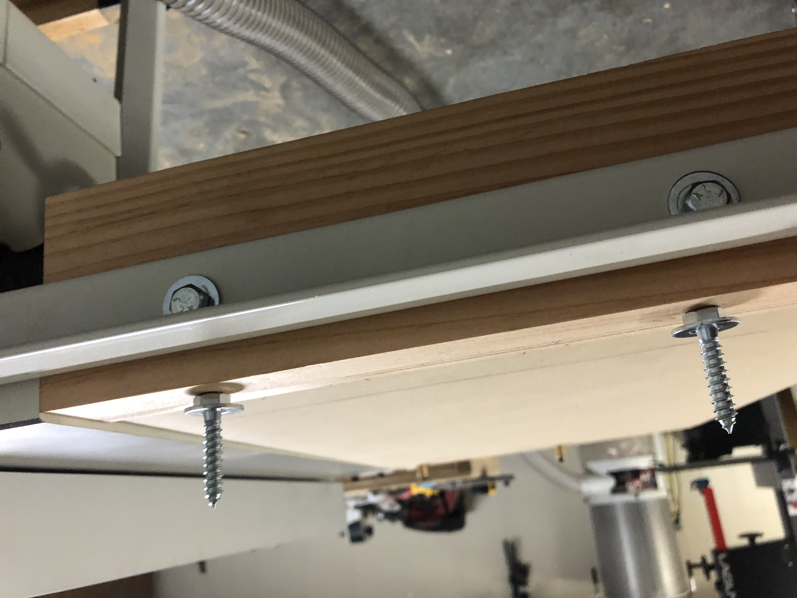

# jet-proshop-ii-router-table-insert

Plans for a DIY router table insert for a Jet Proshop II table saw that allows you to keep both wings in place.

I was originally planning to make a different design but made a cut in the wrong place and had to improvise with my remaining wood on hand as I didn't want to go to the store again. 

Fortunately, I ended up coming with a plan that I like much more :)

## Status

I'm not actually done building this, so some of what I describe below is what I **intend** to do but isn't shown in the pictures.

# Benefits

Some things I like about this plan:

* **Keep your table saw wings** - other plans I saw often called for removing a table saw wing and making a router table insert to take its place. This design allows you to keep your existing wings.

* **Wiggle room on table insert and rail height** - this design intentionally allows you to make the insert just a little shy (say 1/16th" to 1/8th") of being flush with the factory saw wing's top and not need to worry about cutting things perfect from the start. This is because you can later adjust the table height with set screws.

* **Wiggle room on table insert's width** - you can get a nice friction fit of the table insert between the rails and don't have to worry about your rabbet width being perfect. This is because you can cut the rabbits as wide or narrow as you want and then later cut a slightly oversized table insert to fit just by taking light passes on your table saw. 

* **Wiggle room on table insert's height** - Since the table insert will have set screws, you have a bit of wiggle room on its height (and corresponding rabbet height on the supports). That being said, you want to use something thick enough to be sturdy when your router is attached but not so thick that it interferes with the screws/bolts you use to attach the supporting rails. In my case, a 3/4" thick table insert seems to be just about perfect.

* **No need to drill any holes in your table saw or factory rails** - I just leverage some of the unused holes in the rails that came with the table saw.

# Design

## Overview

Two 15" 4x4s are jointed on two adjacent faces. One jointed face will be flush with the table saw rails and the other jointed face will be facing up toward the ceiling. The inside edge of the rails are given a rabbet that allows you to drop in a table face of your choice. 

## Front rail
The 1st 4x4 is attached to the front rail using two [M8-1.25 20mm countersunk screws](https://www.amazon.com/gp/product/B07X9G5KZ9/ref=ppx_yo_dt_b_asin_title_o02_s00?ie=UTF8&psc=1) and [E-Z Lok 400 M8-1.25 0.625" brass inserts](https://www.amazon.com/gp/product/B002WC8TRK/ref=ppx_yo_dt_b_asin_title_o02_s03?ie=UTF8&psc=1). It feels sturdy for now, but haven't actually attached the router and worked with it to know whether it will hold up. If I did it again, I might want to use slightly longer screws and inserts... but I would have to first make sure they wouldn't interfere / cross into the space of the rabbet that we cut to hold the router table board (described later).

## Back rail
The 2nd 4x4 is attached to the back rail using two 5/16ths x 1" flat hex-head lag screws and washers (at least, that's what I think they are... I need to go back and double check). Just want to emphasize - unlike the front rail holes which are countersunk, the back rail holes are flat.

So... why did I use M8 screws with brass inserts in the front but lag screws in the back? Well, because I only hand the M8 countersunk screws and 5/16 lag screws on hand at the time!

## Rabbet and table
Each 4x4 has a rabbet on the top-inner face approx. 1.5" inward and 0.75" deep. This allows you to drop in a 0.75" table board (MDF, in case) of your choice. 

# Areas for improvement

## 4x4 rails not same height

Both 4x4 rails are intentionally shy of the adjacent wing, but I made a mistake and one is more shy than the other. I wanted them shy by maybe 1/16th, but my back rail is closer to 3/16th.

## Set screws in the table

It's not pictured, but I intend to add set screws to the four corners of the MDF drop in so that its really easy to make the table level with the saw wing surface. 

## Side truss for stability

If you look at the right-most edge of the table insert, it's unsupported between the two ends of the 4x4 posts. Maybe it makes sense to put some kind of perpendicular brace there? as I haven't yet attached the router, not sure how the weight will impact things. The deep rabbets on the 4x4 braces might be sturdy enough?
